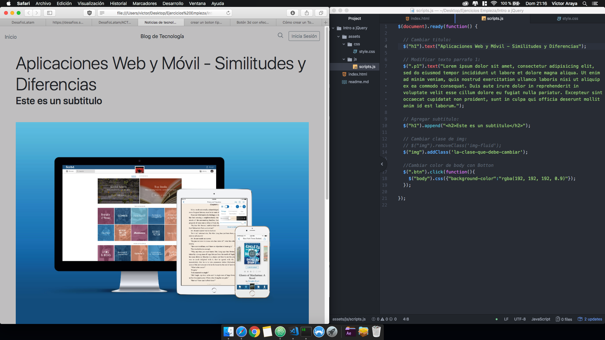

<section>

# Actividad selección de elementos Jquery.

### [Ejercicio planteado.](https://github.com/DesafioLatam/ACTJS-D1B)

---

## Ejercicio Resuelto:

### [Ejercicio resuelto.](https://varayac.github.io/Actividad-Intro-a-jQuery/)

**Intrucciones:**
1. cambia el título por uno nuevo. - Listo
2. modifica el texto del párraro 1. - Listo
3. Crea un subtítulo debajo del título del post. - Listo
4. cambia la clase de la imagen por la siguiente: - Listo
	-	"la clase que debe cambiar".
4. Cambia el color del body usando el botón (botón que estára al final de la página). - Listo
 
